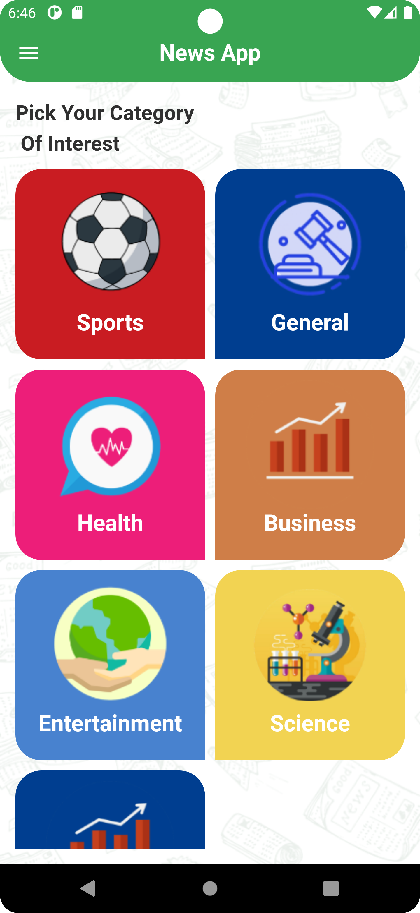
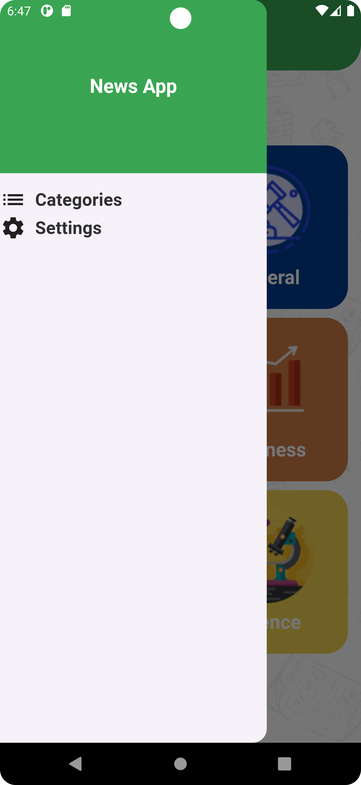
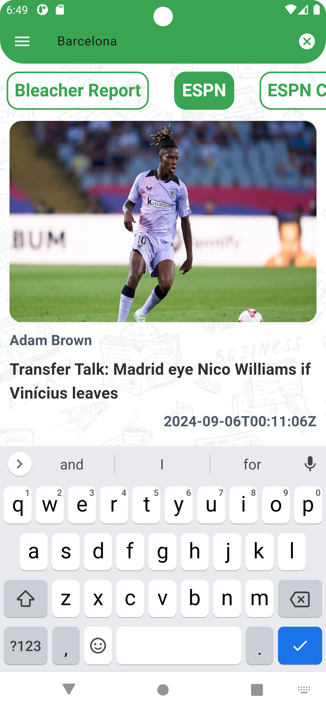
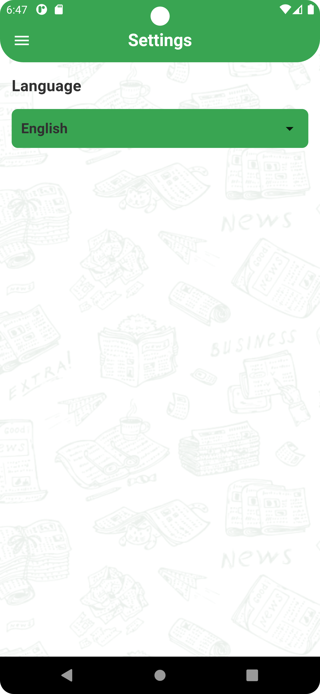

# News App

A comprehensive Flutter application designed to display news articles sourced from an API. The app
offers a user-friendly interface with categorized news sources, search functionality, and detailed
views for each article.

## Features

- **Categories Screen**: View different news categories and select a category to display relevant
  news sources.
- **News Sources**: Upon selecting a category, view a list of news sources and their associated
  articles.
- **Search Functionality**: Easily search for specific news articles.
- **Pagination**: Load more news articles seamlessly as the user scrolls.
- **State Management**: Efficient management of the app's state for a smooth user experience.
- **Settings Screen**: Change the app's language from the settings tab.
- **Full Article View**: Each news item includes a button to view the full article on a dedicated
  detail page, providing all relevant information.

## Technologies Used

- **Flutter**: Cross-platform mobile framework.
- **Dart**: Programming language for Flutter.
- **API Integration**: Fetch news articles from an external API.
- **Provider**: State management solution.
- **Localization**: Supports multiple languages.

## Getting Started

To run the application locally, follow these steps:

1. Clone the repository:
   ```bash
   git clone https://github.com/yourusername/news_app.git

### Screen Shots







